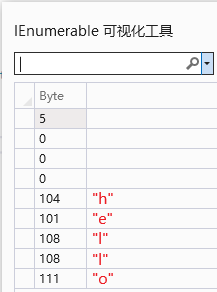

# 🌐 WinForms_TCP_Demo

## Windows 推荐环境

* [Visual Studio 2022](https://visualstudio.microsoft.com/zh-hans/vs/) 17.7.3
* [Microsoft .NET Framework](https://dotnet.microsoft.com/zh-cn/download/dotnet-framework) 4.8.09037
* [「.NET 桌面开发」工作负荷](https://learn.microsoft.com/zh-cn/visualstudio/ide/create-csharp-winform-visual-studio?view=vs-2022)

## Demo 使用

本 Demo 与普通的 TCP 服务端和客户端使用并无区别。服务端配置自己的 IP 地址和端口号并开始监听；客户端匹配服务端的 IP 地址和端口号连接即可。建立连接后，双方**仅可以**互相发送文本消息。

## 本 Demo 主要有两点不一样的地方：

### 📌 不同点一

> 首先，双方的数据编解码方式是有要求的：

1. 默认情况下文本数据通过 UTF-8 编解码即可直接打包/解析； 

2. 此外还有一种方式，即为每个数据包添加一个四字节包头，包头用于表征包体的长度（字节数），这种方式是[防止 TCP 粘包的一种办法](https://zhuanlan.zhihu.com/p/387256713)。 

> 相关源码可以参考 [DataProcessing](https://github.com/YMGogre/WinForms_TCP_Demo/blob/master/BLL/DataProcessing.cs) 类。

### 📌 不同点二

> Demo 中的 TCP 服务端和客户端都有「**快捷消息栏**」。

<dl>
    <dt>快捷消息</dt>
    <dd>指可以通过下拉框快速选择并发送出去的消息。这在需要频繁发送某些重复消息的场合十分有用，省去了用户多次重复编辑的麻烦。并且<em>快捷消息并不会随着程序退出而丢失</em>，在下次启动程序后，已有的快捷消息会仍然存在。</dd>
    <dt>添加快捷消息</dt>
    <dd>在 TCP 服务端，您可以通过首页「快捷消息栏」中的 "+" 号按钮新增一个快捷消息 

 在 TCP 客户端，您可以通过「快捷消息栏」中的 "+" 号按钮新增一个快捷消息 

</dd>
    <dt>快捷消息的格式</dt>
    <dd>快捷消息分为“<strong>快捷消息名称</strong>”和“<strong>快捷消息内容</strong>”。其中快捷消息名称就是快捷消息栏中下拉框内显示的名称；而快捷消息内容，顾名思义就是消息的具体内容啦： 

</dd>
    <dt>快捷消息的保存位置</dt>
    <dd>通过上面的信息我们已经了解到“快捷消息不会随着程序退出而丢失”。为了做到这一点，实际上快捷消息是保存在文件当中的。文件默认被保存在项目的当前工作目录下，一个名为 "<strong>QuickMessage.json</strong>" 的文件： 

</dd>
    <dt>删除已有的快捷消息</dt>
    <dd>目前，Demo 并没有提供删除快捷消息的功能。有需求删除某些快捷消息的同学，需要自行前往保存快捷消息的文件当中手动删除（<em>*.json</em> 文件可直接通过记事本或其他文本编辑程序打开编辑）。默认情况下，一项快捷消息占用一行内容： 

</dd>
</dl>

## 使用示例

1. ✅ 消息的发送与接收： 

2. ✅ 服务端广播发送消息： 

3. ✅ 添加快捷消息： 

4. ✅ 发送快捷消息： 

