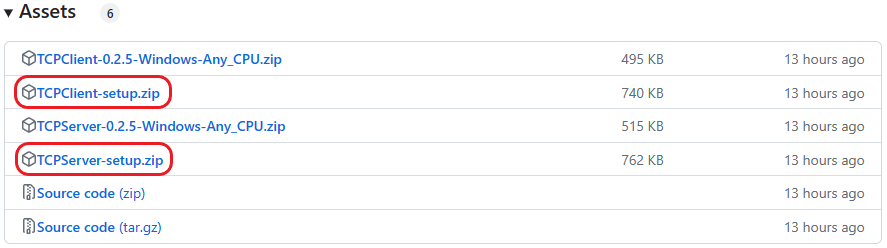
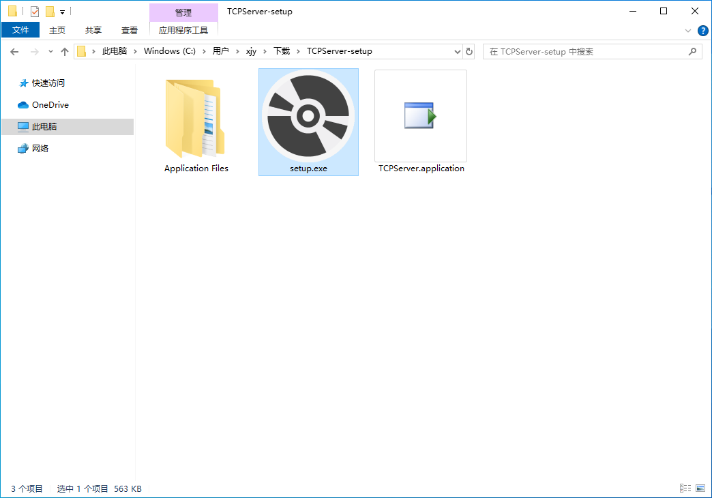
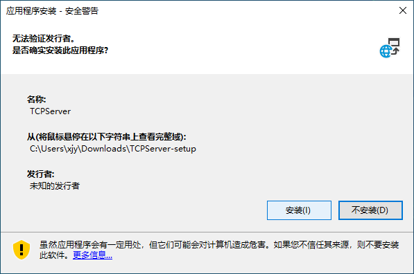
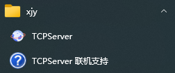

# 下载安装教程

1. 首先前往[最新的发行版](../releases/latest)，下载两个压缩包文件：

    * TCPServer-setup.zip
    * TCPClient-setup.zip
    

2. 接下来我们以 `TCPServer-setup.zip` 压缩包为例讲解安装过程，另一个 `TCPClient-setup.zip` 与之类似。
3. 下载完成后解压压缩包，可以看到压缩包内包含如下图所示的三个文件： 
4. 双击 `setup.exe` 运行，随后会弹出应用程序安装的安全警告。点击【安装】： 

    > 由于是个人仓库，笔者并未研究如何为应用程序设置数字签名。所以会出现无法验证发行者的情况，无需担心正常安装即可。

5. 安装完成后，系统会自动运行软件。桌面和开始菜单栏也会自动生成快捷方式。之后就可以开始愉快地使用啦！ 

    > 开始菜单栏快捷方式位于名为 `xjy` 的文件夹下。

---

## 🏷️ [前往使用教程](./README.md)